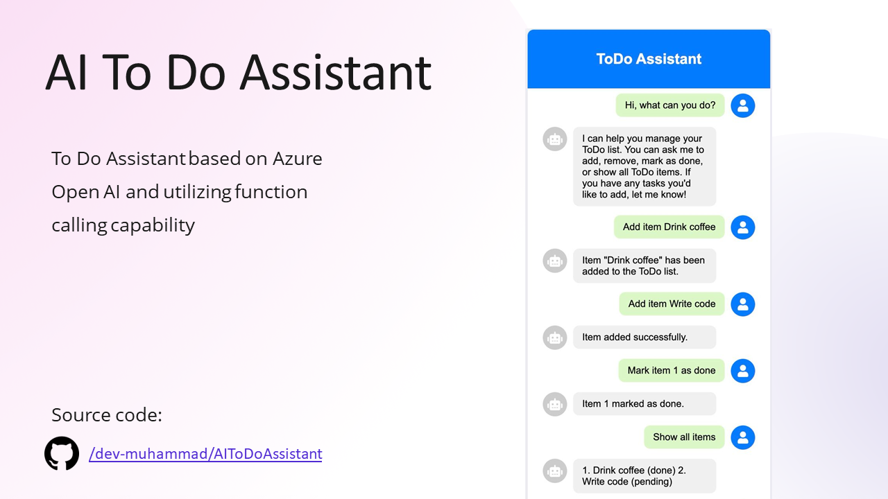

# AI ToDo Assistant
Todo Assistant based on Azure Open AI sdk utilizing function calling capability



---
## Overview
This demo project was created for the .NET Summer Conference organized by the .NET Community Tajikistan in Khujand, June 2024. The main goal is to encourage developers to integrate the powerful capabilities of Large Language Models (LLMs) into their projects.

## Slides
You can view the slides from the presentation [here](Resources/Slides.pdf).

## Features
- **Function Calling**: Utilize the advanced function calling capabilities of the Azure OpenAI SDK.
- **Seamless Integration**: Easy to integrate with existing .NET applications.

## Getting Started
### Prerequisites
- [.NET 8.0 SDK](https://dotnet.microsoft.com/download/dotnet/8.0)
- Azure Subscription with OpenAI enabled

### Installation
Clone the repository:
```bash
git clone https://github.com/dev-muhammad/AIToDoAssistant.git
cd TodoAssistant
```


### Configuration
1. **Azure Setup**: Ensure you have the necessary Azure resources set up. Refer to the Azure OpenAI documentation for detailed instructions.
2. **Configuration File**: Update the `appsettings.json` file with your Azure credentials and configuration settings.

### Usage
Run the application:
```bash
dotnet run
```

## Testing
This project was tested with `Azure.AI.OpenAI SDK Version = 1.0.0-beta.13`. Make sure to use this version or later for compatibility.

## Contributing
We welcome contributions! Please fork the repository and submit a pull request with your changes.

## License
This project is licensed under the MIT License - see the [LICENSE](LICENSE) file for details.

## Acknowledgements
Special thanks to the .NET Community Tajikistan for organizing the .NET Summer Conference and providing the platform to showcase this project.

## Support
If you found this project useful, please consider starring the repository. Follow my profile to stay updated on new projects and developments.

[](https://github.com/dev-muhammad/AIToDoAssistant)
[](https://github.com/dev-muhammad)